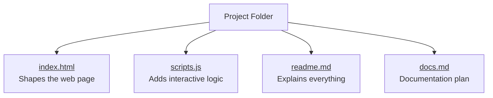
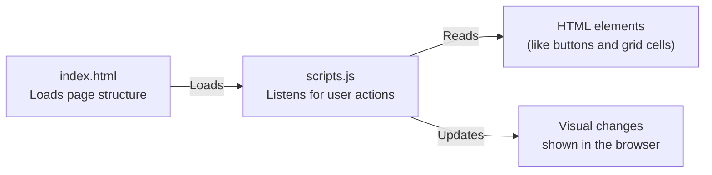
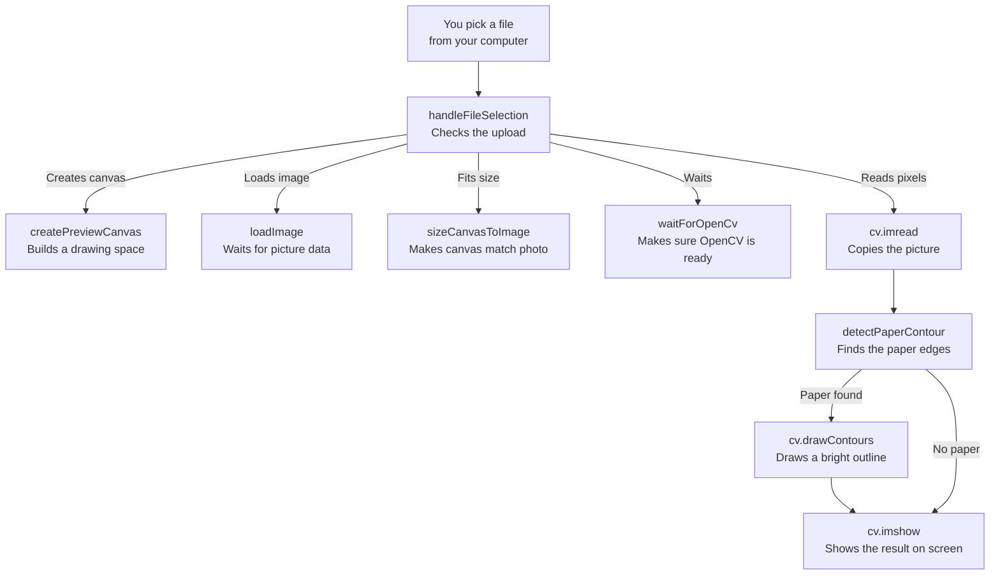
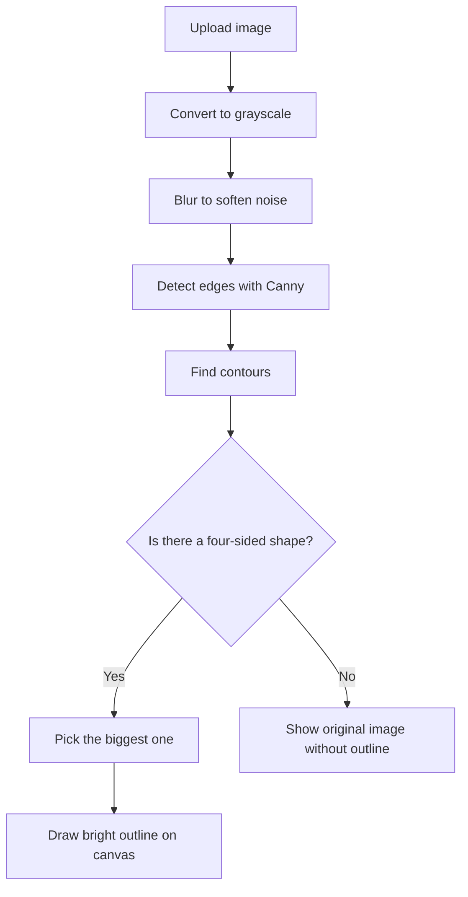

# GridFinium Frontend Guide

Welcome! This guide explains how the GridFinium frontend fits together using easy language and simple flowcharts. If you are around 14 years old and curious about how the project works, you are in the right place.

## How the codebase is organized
The project lives in a small folder with a handful of important files. Follow the flowchart to see how everything connects.

### What each part does
- **index.html** sets up the basic layout of the page, similar to building the frame of a house.
- **scripts.js** adds the behaviors, like placing the furniture and making buttons respond when clicked.
- **docs.md** stores instructions about how to document the project.
- **readme.md** (this file) shows you how the pieces fit together.

## How the main files work together
The next flowchart zooms in on the logic inside the HTML and JavaScript files and shows the usual path of information.

### Step-by-step explanation
1. **The browser reads `index.html`** and draws the page.
2. **`scripts.js` runs right after** and looks for buttons, inputs, or grid cells to control.
3. **When you interact with the page**, the script reacts by changing numbers, colors, or text.
4. **The browser updates the view**, so you instantly see the result of what just happened.

## scripts.js logic explained
The JavaScript file is made of small functions that work together whenever you upload a picture of a sheet of paper.

### Function-by-function tour
- **`handleFileSelection(event)`** – runs when you choose a file, creates the canvas, loads the image, waits for OpenCV, and triggers the paper detection steps.
- **`createPreviewCanvas()`** – builds a fresh `<canvas>` element where the processed picture will be displayed.
- **`sizeCanvasToImage(canvas, imageElement)`** – copies the photo’s width and height onto the canvas so the outline lines up perfectly.
- **`loadImage(imageElement, src)`** – returns a promise that resolves once the browser finishes loading the image data from the chosen file.
- **`waitForOpenCv()`** – keeps checking until the OpenCV library is ready to use.
- **`detectPaperContour(src)`** – converts the picture to gray, finds strong edges, and keeps the largest four-sided shape it sees (the sheet of paper).
- **`cv.drawContours(...)` inside the handler** – if a contour is found, draws a thick green outline around it before showing the final picture.

## Paper outlining process
The outline you see on the preview is created through a few clear stages. Follow the chart and steps to understand what happens after you upload a photo.

### Step-by-step
1. **Convert to grayscale.** Removing color makes it easier to spot the paper’s edges.
2. **Blur the picture.** A gentle blur washes away tiny speckles so the outline is less wiggly.
3. **Find edges.** The Canny algorithm traces strong transitions from dark to light, highlighting the paper border.
4. **Search for contours.** The script gathers shapes formed by those edges.
5. **Pick the paper.** It looks for the largest contour with four sides—this is almost always the sheet.
6. **Draw the outline.** A bright green contour is painted onto the canvas so you can clearly see the detected paper.
7. **Fallback if nothing fits.** If no four-sided shape is found, the original photo is shown so you know detection failed.

## Need to change something?
- Update `index.html` if you want to change the layout or add new sections to the page.
- Edit `scripts.js` if you want to change how the page behaves when someone clicks or types.
- Keep this `readme.md` updated so future developers (and curious students) can follow along easily.

Happy exploring and building!
